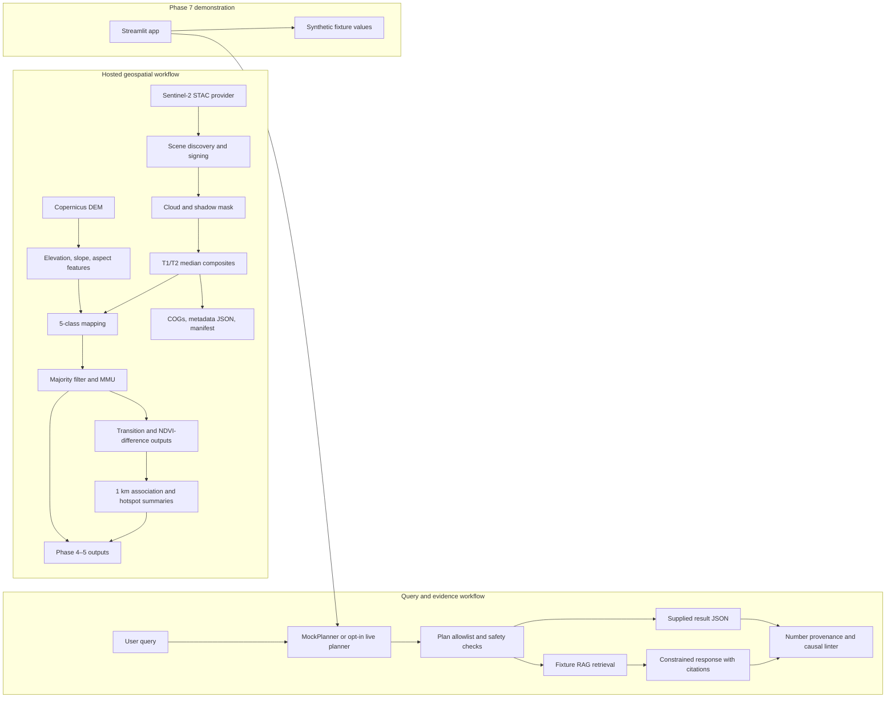

# GEO-INTEL architecture

The diagram shows the implemented project flow and the distinction between the
deterministic geospatial pipeline and the fixture-only demo/agent path. Hosted
raster execution and production integration are not verified.

The Streamlit app uses only synthetic fixture values and the deterministic mock
planner. It does not read the geospatial outputs shown in the hosted-workflow
subgraph. See [Phase 7 report](phase7_report.md) and [limitations](limitations.md).
