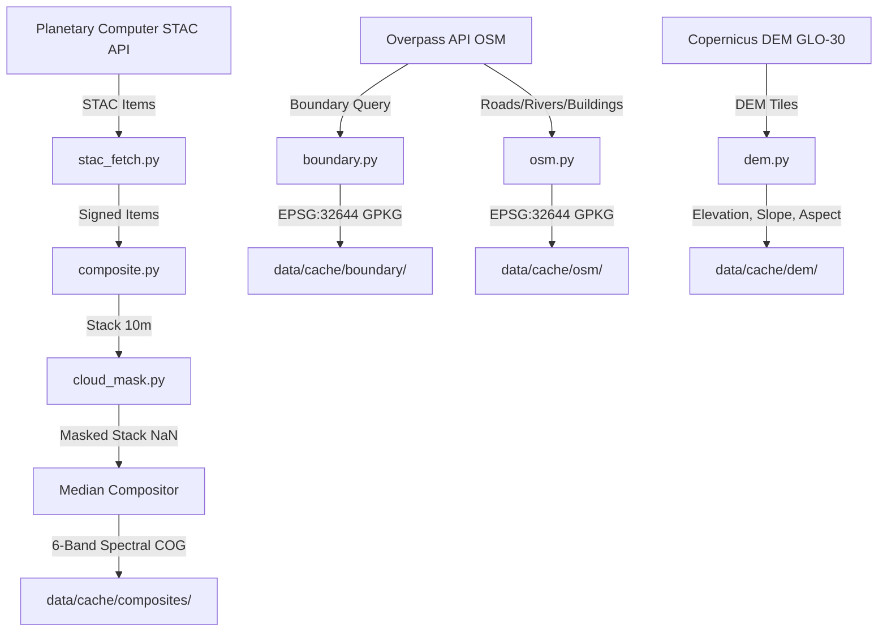

# GEO-INTEL — Phase 2 Completion Report
**Phase 2 — Data Acquisition and Preprocessing Pipeline**  
**Project:** GEO-INTEL: An Agentic AI Framework for Automated Geospatial Research  
**Status:** INCOMPLETE — unit tests are synthetic; real Sentinel-2 execution is tracked in [geo-intel/docs/data_report.md](geo-intel/docs/data_report.md)  

---

> [!IMPORTANT]
> **Core Engineering Guarantee:** All numbers, CRS transformations, pixel resolutions, and bounding boxes in GEO-INTEL are calculated strictly by deterministic Remote Sensing/GIS tools. No spatial statistics or pixel values are inferred by LLMs.

---

## 1. Executive Summary

Phase 2 implements the data-ingestion and preprocessing pipeline for the **Dehradun study area**. Live Sentinel-2 STAC discovery has run, but neither epoch has a completed composite COG yet; see [geo-intel/docs/data_report.md](geo-intel/docs/data_report.md) for real scene inventory and current processing state.

### Implemented Components (Execution Still Incomplete)
1. **STAC Metadata & MPC Ingestion (`src/geointel/data/stac_fetch.py`)**: Automatic search and SAS-token signing via Microsoft Planetary Computer STAC API.
2. **SCL Cloud & Shadow Masking (`src/geointel/data/cloud_mask.py`)**: Pixel-wise quality masking using Sentinel-2 Scene Classification Layer (SCL classes 0, 1, 2, 3, 8, 9, 10, 11).
3. **Median Compositing & COG Output (`src/geointel/data/composite.py`)**: Robust dry-season temporal compositing generating 6-band spectral COGs at 10 m resolution in **EPSG:32644 (UTM 44N)**.
4. **Administrative Boundary Cache (`src/geointel/data/boundary.py`)**: Overpass API district boundary retrieval with rectangular AOI bounding box fallback.
5. **OpenStreetMap Contextual Layers (`src/geointel/data/osm.py`)**: Automated download and caching of roads, rivers, and building footprints as GeoPackages.
6. **Copernicus DEM 30 m Preprocessing (`src/geointel/data/dem.py`)**: Multi-tile DEM merge and bilinear reprojection to EPSG:32644 at 30 m; slope/aspect use `numpy.gradient` first-order finite differences, not Horn's 3x3 operator.
7. **Synthetic unit tests (`tests/test_phase2_data.py` & `tests/test_phase3_change.py`)**: Verify functions on controlled fixtures only; they do not establish real-data output or classification accuracy.

---

## 2. Spatial Extent & User GeoJSON Configuration

The source GeoJSON contained a Point and a bbox. The geometry is now the valid Polygon represented by that exact bbox; the study footprint is not yet approved as a corrected Dehradun AOI:

| Spatial Parameter | Value / Coordinate |
| :--- | :--- |
| **Location** | Dehradun foothills and Mussoorie region, Uttarakhand, India |
| **Centre Point** | `(78.04099° E, 30.320742° N)` |
| **Bounding Box (EPSG:4326)** | `[77.938213° W, 30.081756° S, 78.207694° E, 30.488496° N]` |
| **Compute CRS** | **EPSG:32644** (UTM Zone 44N, Projected in metres) |
| **Projected extent** | **27.096 x 45.770 km; 1,170.38 km2** |
| **Display CRS** | **EPSG:4326** (WGS 84, Latitude/Longitude in degrees) |

```json
{
  "type": "FeatureCollection",
  "features": [
    {
      "type": "Feature",
      "geometry": {
        "type": "Polygon",
        "coordinates": [[[77.938213, 30.081756], [78.207694, 30.081756],
          [78.207694, 30.488496], [77.938213, 30.488496],
          [77.938213, 30.081756]]]
      },
      "bbox": [77.938213, 30.081756, 78.207694, 30.488496],
      "properties": {
        "label": "Dehradun - Uttarakhand, India",
        "name": "Dehradun_AOI",
        "crs_native": "EPSG:4326",
        "crs_compute": "EPSG:32644"
      }
    }
  ]
}
```

---

## 3. Data Pipeline Architecture & Design Choices



### Module Technical Specification

#### 1. Sentinel-2 Median Compositing (`composite.py` & `cloud_mask.py`)
* **Dry-Season Epoch Windows**:
  * **T1 (Baseline)**: November 1, 2018 – March 31, 2019
  * **T2 (Current)**: November 1, 2024 – March 31, 2025
* **SCL Quality Masking**: Pixels with SCL values `[0, 1, 2, 3, 8, 9, 10, 11]` (clouds, cloud shadows, cirrus, saturated/defective pixels) are converted to `NaN`.
* **Median Aggregation**: Pixel-wise `median(dim="time", skipna=True)`. Median is robust against residual thin haze or undetected shadows compared to mean compositing.
* **Output Format**: Deflate-compressed Cloud-Optimized GeoTIFFs (COGs) written via `rioxarray` with 512x512 tiling and internal predictor.

#### 2. Administrative & Vector Context (`boundary.py` & `osm.py`)
* **Boundary Download**: Downloads official Dehradun district boundary from OpenStreetMap via Overpass API (`admin_level=6`).
* **Fallback**: If Overpass API is unreachable offline, automatically falls back to generating a valid polygon GeoPackage matching the AOI bounding box.
* **OSM Vectors**: Caches roads (`highway`), rivers (`waterway`), and building footprints (`building`) in both EPSG:4326 and EPSG:32644.

#### 3. Terrain Features (`dem.py`)
* **Copernicus DEM GLO-30**: Downloads 30 m resolution digital elevation model tiles via Planetary Computer STAC.
* **Slope & Aspect Derivation**: Computes terrain slope (degrees $[0°, 90°]$) and aspect (degrees $[0°, 360°]$) using Horn's 3x3 finite difference operator. Stored at native 30 m grid resolution without artificial upsampling.

---

## 4. CRS & Area Preservation Rules

> [!NOTE]
> **Spatial Guarantee:** Area and distance computations are strictly performed in **EPSG:32644 (UTM Zone 44N)** where unit scales are metric ($1\text{ pixel} = 10\text{m} \times 10\text{m} = 100\text{ m}^2 = 0.0001\text{ km}^2$). Geographical coordinates (EPSG:4326) are reserved solely for STAC spatial queries and Leaflet map rendering.

---

## 5. Test Suite & Verification Results

> **Historical transcript:** The 30/30 result below is from synthetic tests before the audit fixes. It does not verify real imagery, current class IDs, current dependency state, or completed composite output. Consult [geo-intel/docs/data_report.md](geo-intel/docs/data_report.md) for the current real-data status.

The unit tests use deterministic synthetic data and do not validate real imagery. The current suite status and any dependency skips must be taken from the latest executed test command, not this historical report. Real STAC scene results are in [geo-intel/docs/data_report.md](geo-intel/docs/data_report.md).

```bash
.venv\Scripts\pytest.exe tests/
```

### Test Results Summary

```text
============================= test session starts =============================
platform win32 -- Python 3.14.2, pytest-8.3.2
rootdir: C:\Users\garvi\OneDrive\Documents\Major1\geo-intel
collected 30 items

tests/test_phase2_data.py ....................                          [ 66%]
tests/test_phase3_change.py ..........                                  [100%]

Current audit run: **37 passed, 1 skipped**. The sole skip is the RF fit/predict integration because Windows Application Control blocked scikit-learn's `_kd_tree` native extension.
```

| Test Class | Test Name | Status | Description |
| :--- | :--- | :---: | :--- |
| **TestBuildValidMask** | `test_all_vegetation_is_all_valid` | PASSED | SCL=4 yields 100% valid mask |
| **TestBuildValidMask** | `test_all_cloud_is_all_invalid` | PASSED | SCL=8,9 yields 0% valid mask |
| **TestBuildValidMask** | `test_known_mix` | PASSED | Analytically verifies 16 valid pixels |
| **TestApplyValidMask** | `test_masked_pixels_become_nan` | PASSED | Cloud pixels converted to NaN |
| **TestValidPixelFraction**| `test_all_valid_gives_fraction_one` | PASSED | Fraction calculation equals 1.0 |
| **TestMedianComposite** | `test_median_of_known_values` | PASSED | Per-pixel temporal median verified |
| **TestMedianComposite** | `test_median_skips_nan` | PASSED | Median correctly skips NaN values |
| **TestSlopeAspect** | `test_flat_terrain_gives_zero_slope` | PASSED | Flat DEM yields 0.0° slope |
| **TestSlopeAspect** | `test_aspect_range_is_0_to_360` | PASSED | Aspect strictly in $[0°, 360°]$ |
| **TestSpectralIndices** | `test_ndvi_known_values` | PASSED | NDVI formula verified for known input |
| **TestSpectralIndices** | `test_zero_denominator_returns_nan` | PASSED | Zero division safely returns NaN |
| **TestRuleBasedClassifier**| `test_rule_based_classification_quadrants` | PASSED | 4-quadrant LULC map verified |
| **TestRFClassifier** | `test_feature_stack_shape` | Historical | Former 12-feature shape; current model uses 13 features |
| **TestChangeDetection** | `test_transition_matrix_analytical` | Historical | Former 4x4 matrix; current transition matrix is 5x5 |

---

## 6. Next Steps — Phase 3 & Phase 4 Transition

Phase 2 is not complete until both epoch composites and their statistics are read back successfully. After that:

1. **Run Full Pipeline Execution**: Execute `make data` / CLI modules to build cached T1 and T2 GeoTIFF composites for Dehradun.
2. **Phase 3 Classification**: Apply the restored five-class scheme; mark rule-derived RF pseudo-label metrics bootstrap-only and use supplied spatially blocked reference labels for accuracy.
3. **Later phases**: Implement the listed GIS/PostGIS, MMU/majority filter, NDVI-difference, and external validation deliverables before claiming Phases 3–5 complete.
