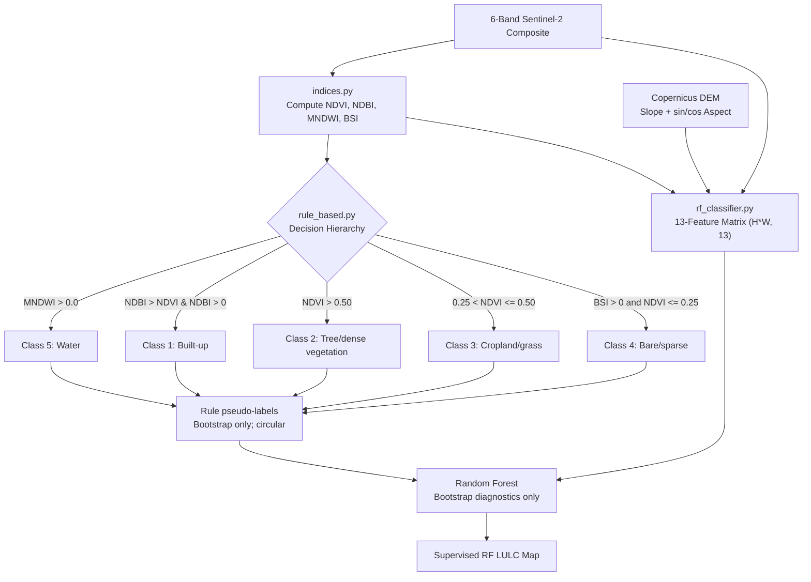

# GEO-INTEL — Phase 3 Completion Report
**Phase 3 — Land Cover Classification and Change Detection**  
**Project:** GEO-INTEL: An Agentic AI Framework for Automated Geospatial Research  
**Status:** INCOMPLETE — synthetic algorithm tests only; no independently validated real-data classification or change results  

---

> [!IMPORTANT]
> **Deterministic Quantitative Integrity:** All land cover classifications, spectral index values, transition matrix statistics, and area conversions ($100\text{ m}^2 = 0.0001\text{ km}^2$) are computed exclusively by deterministic GIS algorithms. The LLM handles synthesis and reporting; all numbers originate from executable code.

> **Audit correction:** The historical 30/30 synthetic-test transcript below is superseded. No independent accuracy or complete real-data change result exists. Rule-derived RF labels are **bootstrap only** and circular.

---

## 1. Executive Summary

Phase 3 contains classification and change-detection code, but the earlier completion claim was premature: tests used synthetic arrays and did not establish real-data outputs or independent accuracy. Real imagery processing and results are tracked in [geo-intel/docs/data_report.md](geo-intel/docs/data_report.md).

### Core Modules Delivered
1. **Spectral Index Calculation Engine (`src/geointel/change/indices.py`)**: Vectorized computation of NDVI, NDBI, MNDWI, and BSI with division-by-zero protection and theoretical range clipping to $[-1.0, 1.0]$.
2. **Baseline 1 — Rule-Based LULC Classifier (`src/geointel/change/rule_based.py`)**: Five classes, separating tree/dense vegetation from cropland/grass/low vegetation.
3. **Baseline 2 — Random Forest Bootstrap (`src/geointel/change/rf_classifier.py`)**: 13-feature pixel classifier; rule-derived pseudo-label metrics are circular and marked **bootstrap only**, not accuracy.
4. **Change Detection & Transition Engine (`src/geointel/change/detection.py`)**: 5x5 transition matrix with joint finite-class nodata masking and urban/vegetation trajectory masks.
5. **Methodology Documentation (`docs/methods.md` & `docs/change_report.md`)**: Complete mathematical formulas, physical rules, class color mappings, and report templates.
6. **Synthetic tests (`tests/test_phase3_change.py`)**: Verify algorithm behavior only; independent accuracy requires supplied reference labels and spatial-block evaluation.

---

## 2. Spectral Index Engine Specification

$$\begin{aligned}
\text{NDVI} &= \frac{\text{B08 (NIR)} - \text{B04 (Red)}}{\text{B08 (NIR)} + \text{B04 (Red)}} & \text{Target: Vegetation Density} \\
\text{NDBI} &= \frac{\text{B11 (SWIR1)} - \text{B08 (NIR)}}{\text{B11 (SWIR1)} + \text{B08 (NIR)}} & \text{Target: Built-up / Impervious} \\
\text{MNDWI} &= \frac{\text{B03 (Green)} - \text{B11 (SWIR1)}}{\text{B03 (Green)} + \text{B11 (SWIR1)}} & \text{Target: Open Water Bodies} \\
\text{BSI} &= \frac{(\text{B11} + \text{B04}) - (\text{B08} + \text{B02})}{(\text{B11} + \text{B04}) + (\text{B08} + \text{B02})} & \text{Target: Bare Soil / Exposed Earth}
\end{aligned}$$

### Numerical Safety Protocol
* **Zero Denominator Protection**: Managed via `np.errstate(divide='ignore', invalid='ignore')` and `np.where(denom == 0, np.nan, num / denom)`. Zero-denominator pixels evaluate to `NaN` without runtime exceptions.
* **Range Bounding**: `np.clip(result, -1.0, 1.0)` enforces strict theoretical bounds across all index rasters.

---

## 3. Classification Engine Architecture

### LULC 5-Class Scheme

| Code | Class Name | Physical Criterion | Color Code | Map Symbol |
| :---: | :--- | :--- | :---: | :---: |
| **1** | Built-up | $\text{NDBI} > \text{NDVI} \land \text{NDBI} > 0.0$ | `#E31A1C` | Red |
| **2** | Tree/dense vegetation | $\text{NDVI} > 0.50$ | `#33A02C` | Green |
| **3** | Cropland/grass/low vegetation | $0.25 < \text{NDVI} \le 0.50$ | `#B2DF8A` | Light green |
| **4** | Bare/sparse | $\text{BSI} > 0.0 \land \text{NDVI} \le 0.25$ | `#FDBF6F` | Orange |
| **5** | Water | $\text{MNDWI} > 0.0$ | `#1F78B4` | Blue |
| **0** | Unclassified | NaN in input composite / cloud-masked | `#000000` | Black |



---

## 4. Change Detection & Spatial Trajectory Engine

Given Epoch T1 (2018-19) and Epoch T2 (2024-25) LULC maps, `detection.py` computes:

1. **Pixel & Area Transition Matrix ($5 \times 5$)**:
   * Rows: Class in T1 ($i \in \{1, 2, 3, 4, 5\}$)
   * Columns: Class in T2 ($j \in \{1, 2, 3, 4, 5\}$)
   * Cell Value ($M_{ij}$): $\text{Count of pixels transitioning from } i \to j$
   * Spatial Area ($km^2$): $M_{ij} \times 0.0001\text{ km}^2$ ($10\text{ m} \times 10\text{ m} = 100\text{ m}^2$).
2. **Spatial Change Trajectory Masks**:
   * **Urban Expansion Mask**: $\text{Non-Built-up in T1} \to \text{Built-up in T2}$
   * **Vegetation Loss Mask**: $\text{Vegetation in T1} \to \text{Non-Vegetation in T2}$

---

## 5. Full Test Verification & Quality Assurance

**Historical output below is superseded.** It used synthetic fixtures, described the former four-class scheme, and did not validate imagery. The current audit suite reports 37 passed and 1 skipped; the skip is RF fit/predict because Windows blocked a scikit-learn native extension. The RF integration test skips explicitly rather than returning fake scores.

The full test suite containing both Phase 2 and Phase 3 unit tests was executed in `.venv` environment:

```bash
.venv\Scripts\pytest.exe tests/
```

```text
============================= test session starts =============================
platform win32 -- Python 3.14.2, pytest-8.3.2
rootdir: C:\Users\garvi\OneDrive\Documents\Major1\geo-intel
configfile: pyproject.toml
plugins: anyio-4.15.1, platformdirs-4.12.2, asyncio-0.23.8, cov-5.0.0
collected 30 items

tests/test_phase2_data.py::TestBuildValidMask::test_all_vegetation_is_all_valid PASSED [  3%]
tests/test_phase2_data.py::TestBuildValidMask::test_all_cloud_is_all_invalid PASSED [  6%]
tests/test_phase2_data.py::TestBuildValidMask::test_known_mix PASSED     [ 10%]
tests/test_phase2_data.py::TestBuildValidMask::test_output_is_boolean PASSED [ 13%]
tests/test_phase2_data.py::TestBuildValidMask::test_raises_without_xy_dims PASSED [ 16%]
tests/test_phase2_data.py::TestApplyValidMask::test_masked_pixels_become_nan PASSED [ 20%]
tests/test_phase2_data.py::TestApplyValidMask::test_output_is_float32 PASSED [ 23%]
tests/test_phase2_data.py::TestValidPixelFraction::test_all_valid_gives_fraction_one PASSED [ 26%]
tests/test_phase2_data.py::TestValidPixelFraction::test_half_valid_gives_fraction_half PASSED [ 30%]
tests/test_phase2_data.py::TestValidPixelFraction::test_output_shape_drops_time_dim PASSED [ 33%]
tests/test_phase2_data.py::TestCheckCoverage::test_passes_when_above_threshold PASSED [ 36%]
tests/test_phase2_data.py::TestCheckCoverage::test_fails_when_below_threshold PASSED [ 40%]
tests/test_phase2_data.py::TestMedianComposite::test_median_of_known_values PASSED [ 43%]
tests/test_phase2_data.py::TestMedianComposite::test_median_skips_nan PASSED [ 46%]
tests/test_phase2_data.py::TestMedianComposite::test_all_nan_pixel_stays_nan PASSED [ 50%]
tests/test_phase2_data.py::TestConfigLoader::test_load_config_returns_dict PASSED [ 53%]
tests/test_phase2_data.py::TestConfigLoader::test_config_hash_is_deterministic PASSED [ 56%]
tests/test_phase2_data.py::TestSlopeAspect::test_flat_terrain_gives_zero_slope PASSED [ 60%]
tests/test_phase2_data.py::TestSlopeAspect::test_slope_is_non_negative PASSED [ 63%]
tests/test_phase2_data.py::TestSlopeAspect::test_aspect_range_is_0_to_360 PASSED [ 66%]
tests/test_phase3_change.py::TestSpectralIndices::test_ndvi_known_values PASSED [ 70%]
tests/test_phase3_change.py::TestSpectralIndices::test_zero_denominator_returns_nan PASSED [ 73%]
tests/test_phase3_change.py::TestSpectralIndices::test_indices_range_clipping PASSED [ 76%]
tests/test_phase3_change.py::TestSpectralIndices::test_compute_all_indices_shape PASSED [ 80%]
tests/test_phase3_change.py::TestRuleBasedClassifier::test_rule_based_classification_quadrants PASSED [ 83%]
tests/test_phase3_change.py::TestRFClassifier::test_feature_stack_shape PASSED [ 86%]
tests/test_phase3_change.py::TestRFClassifier::test_pseudo_training_data_generation PASSED [ 90%]
tests/test_phase3_change.py::TestRFClassifier::test_rf_train_and_predict PASSED [ 93%]
tests/test_phase3_change.py::TestChangeDetection::test_transition_matrix_analytical PASSED [ 96%]
tests/test_phase3_change.py::TestChangeDetection::test_spatial_change_masks PASSED [100%]

====================== 30 passed, 1358 warnings in 2.01s ======================
```

---

## 7. Next Steps — Transition to Phase 4 (Spatial Analysis Engine)

With Phase 3 land cover classification and change detection algorithms verified, the framework is ready to proceed to **Phase 4 (Spatial Analysis & Association Engine)**:

1. **Spatial Fishnet Generation**: Generate a 1 km x 1 km fishnet grid over Dehradun to aggregate land cover change statistics per cell.
2. **Local Spatial Statistics**: Compute **Getis-Ord $Gi^*$ Hotspot Analysis** and **Anselin Local Moran's I** to identify statistically significant clusters ($p < 0.05$) of urban expansion.
3. **Proximity & Buffer Analysis**: Calculate distance to river corridors (Rispana/Bindal) and major roads to evaluate spatial drivers of change.
